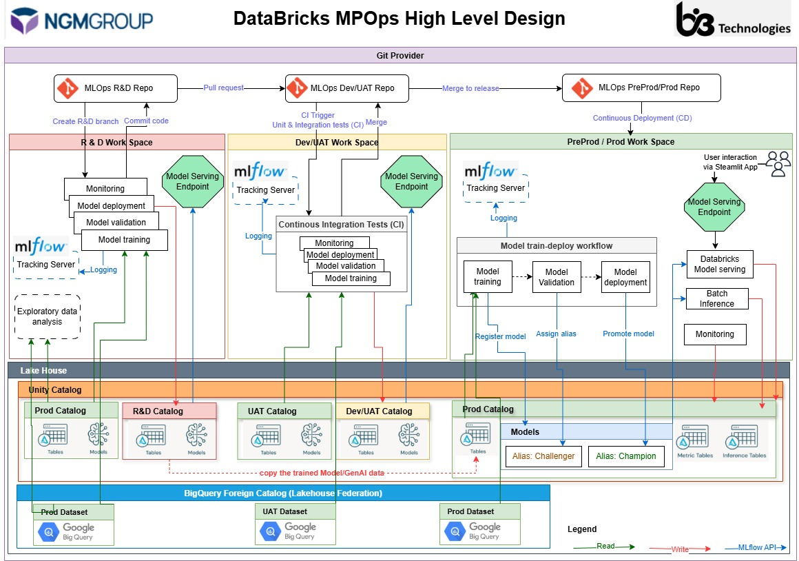

# ngm_mlops

This directory contains an ML project based on the default
[Databricks MLOps Stacks](https://github.com/databricks/mlops-stacks),
defining a production-grade ML pipeline for automated retraining and batch inference of an ML model on tabular data.
The "Getting Started" docs can be found at https://learn.microsoft.com/azure/databricks/dev-tools/bundles/mlops-stacks.

See the full pipeline structure below. The [MLOps Stacks README](https://github.com/databricks/mlops-stacks/blob/main/Pipeline.md)
contains additional details on how ML pipelines are tested and deployed across each of the dev, staging, prod environments below.




## Repository Structure

```
ngm_mlops/
├── .github/workflows/          # CI/CD automation
│   ├── cd-rnd.yml              # Unit tests + RND deploy
│   ├── cd-dev.yml              # Integration tests + DEV deployment
│   ├── cd-uat.yml              # UAT deployment
│   ├── cd-preprod.yml          # PREPROD deployment
│   └── cd-prod.yml             # PROD deployment + gates
│
├── src/                         # Python source code
│   ├── common/                 # Shared utilities
│   │   ├── config.py           # Configuration loader
│   │   ├── logger.py           # Structured logging
│   │   ├── exceptions.py       # Custom exceptions
│   │   ├── drift.py            # Drift detection
│   │   ├── data_quality.py     # Quality checks
│   │   └── mlflow_utils.py     # MLflow helpers
│   │
│   ├── models/                 # Per-model implementations
│   │   ├── base.py             # defines the interface that every component in your MLOps framework must follow
│   │   ├── registry.py         # Model registry management
│   │   ├── churn/              # Churn model
│   │   │   ├── trainer.py
│   │   │   ├── inference.py
│   │   │   ├── validator.py
│   |   |   ├── features.py      
│   │   |   └── sql/            # SQL logic 
│   │   │
│   │   └── fraud/              # Fraud model
│   │       ├── trainer.py
│   │       ├── inference.py
│   │       ├── validator.py
│   |       ├── features.py
│   │       └── sql/            # SQL logic 
│   │
│   └── pipelines/              # Orchestration entry points
│       ├── train.py            # Training pipeline
│       ├── validate.py         # Validation pipeline
│       ├── inference.py        # Batch inference pipeline
│       └── monitor.py          # Monitoring pipeline
│
├── resources/                  # IaC - Databricks resources
│   ├── serving/                # Model end points
│   └── jobs/                   # Job definitions
│       ├── train.yml
│       ├── validate.yml
│       ├── batch_inference.yml
│       └── feature_engineering.yml
│
├── tests/                      # Test suite
│   ├── integration/
│   |   └── test_pipelline.py
│   └── unit/
│       ├── test_trainer.py
│       └── test_smoke.py
│
├── docs/                       # Documentation
│   ├── ARCHITECTURE.md         # This file
│   ├── CONFIGURATION-GUIDE.md  # Setup guide
│   ├── CI-CD-GUIDE.md          # Workflow guide
│   ├── ENVIRONMENT-STRATEGY.md # Environment Strategy guide
│   ├── TESTING-SUITE.md        # Testing Suite
│   └── MODEL-LIFECYCLE.md      # Model flow guide
│
├── databricks.yml              # Bundle configuration (environment-driven)
├── pyproject.toml
├── requirements.txt
└── README.md
```


## Other Documents

→ [Architecture](./docs/ARCHITECTURE.md) - Overall Architecture

→ [Configuration Guide](./docs/CONFIGURATION-GUIDE.md) - Set up environments

→ [Environment Strategy](./docs/ENVIRONMENT-STRATEGY.md) - Envionment and deployment Strategy

→ [CI/CD Guide](./docs/CI-CD-GUIDE.md) - Understand workflows

→ [Model Lifecycle](./docs/MODEL-LIFECYCLE.md) - Model flow
